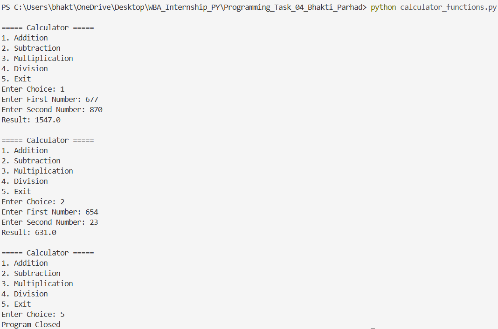
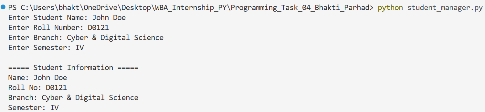
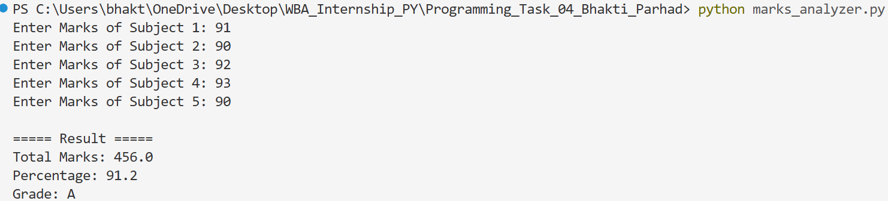
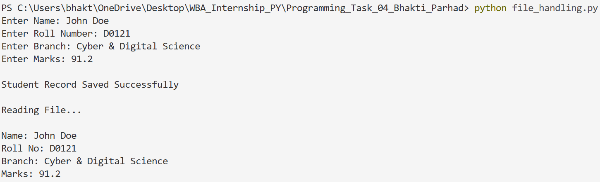
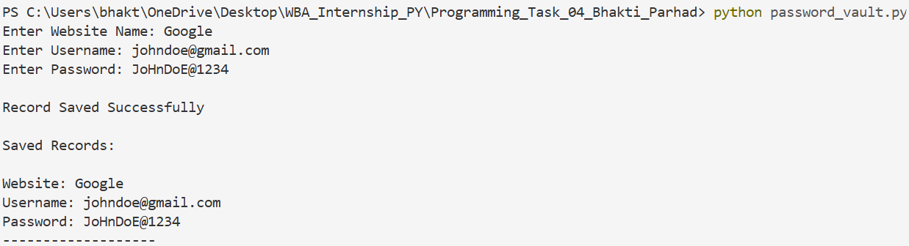
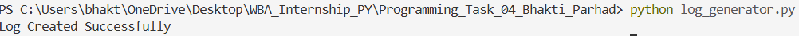

# Programming Task 04 - Python Programming

## Objective

The purpose of this task is to understand:

* Functions
* Modular Programming
* File Handling
* Data Storage
* Logging Systems
* Structured Programming

This task was completed using Python.

---

# Part A - Calculator Functions

## Description

This program performs basic arithmetic operations using separate functions.

Operations Supported:

* Addition
* Subtraction
* Multiplication
* Division

Functions Used:

* addition()
* subtraction()
* multiplication()
* division()

## Screenshot



---

# Part B - Student Information Manager

## Description

This program accepts student information and displays it in a formatted manner using functions.

Information Collected:

* Student Name
* Roll Number
* Branch
* Semester

Function Used:

* display_student()

## Screenshot



---

# Part C - Marks Analysis System

## Description

This program accepts marks for five subjects and calculates:

* Total Marks
* Percentage
* Grade

Grade Criteria:

| Percentage | Grade |
| ---------- | ----- |
| 90+        | A     |
| 80+        | B     |
| 70+        | C     |
| 60+        | D     |
| Below 60   | F     |

Function Used:

* calculate_grade()

## Screenshot



---

# Part D - File Handling Challenge

## Description

This program stores student information inside a text file and then reads the stored data.

File Created:

* student_data.txt

Operations Performed:

* Write Data
* Read Data
* Display Data

Functions Used:

* open()
* write()
* read()
* close()

## Screenshot



---

# Part E - Password Vault Simulator

## Description

This program stores website login information inside a text file.

Information Stored:

* Website Name
* Username
* Password

File Created:

* vault.txt

Operations Performed:

* Add Record
* Save Record
* Display Saved Records

Functions Used:

* open()
* write()
* read()
* close()

## Screenshot



---

# Bonus Challenge - Log File Generator

## Description

This program creates a log entry whenever the program runs.

Information Stored:

* Date
* Time
* Program Activity

File Created:

* activity_log.txt

Functions Used:

* datetime.now()
* write()

## Screenshot



---

## Activity Log File

The program generates the following log file:

### activity_log.txt

```text
2026-06-13 17:27:26.151548 - Program Started
```

---

# Concepts Practiced

* Functions
* Parameters and Arguments
* Return Statements
* Conditional Statements
* Loops
* File Handling
* Data Storage
* Logging Systems
* Modular Programming
* Structured Programming

---

# Learning Outcome

This task helped in understanding how professional applications organize code using functions and modules. It also provided practical experience with file handling, data storage, logging systems and structured programming concepts using Python.

---

# Author

Bhakti Mahadev Parhad

White Band Associates Summer Internship Program
